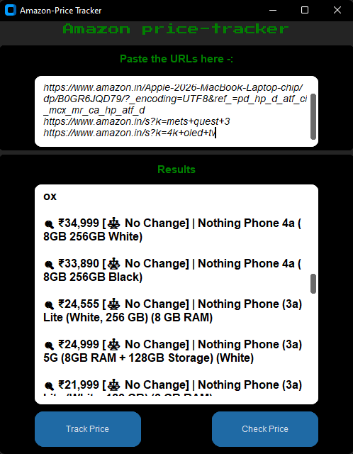

# Amazon Price Tracker

A professional desktop application that tracks Amazon product prices and compares them over time.

Built with Python, Playwright, BeautifulSoup, and CustomTkinter.

---

## 🚀 Features

- Track prices from **single product pages** and **search result pages**
- Paste **multiple URLs at once**
- Real-time scraping using a headless browser
- Save scraped data into CSV
- Compare old vs new prices (Price Drop / Increase / No Change)
- Clean and responsive GUI (no freezing)

---

## 🧠 How It Works

### 🔹 1. URL Input
- User pastes one or multiple Amazon URLs
- URLs are extracted using regex

---

### 🔹 2. Smart Routing System
The app detects the type of page:

- `/dp/` or `/gp/` → Single Product Page  
- `/s?` → Search Results Page  

And applies the correct scraping logic automatically.

---

### 🔹 3. Data Extraction

Using BeautifulSoup:

- Product Name → `#productTitle`
- Product Price → `.a-price-whole`

For search pages:
- Extracts multiple products at once

---

### 🔹 4. Live Scraping Engine

- Uses Playwright (Chromium)
- Runs in headless mode
- Adds delay to mimic human behavior
- Prevents blocking

---

### 🔹 5. Results Display

- Shows structured results inside GUI
- Live updates while scraping
- Uses emojis for clarity:
  - 🛍️ Single product
  - 🔍 Search results

---

### 🔹 6. CSV Export

- User selects save location
- Data saved as: URL | Product Name | Product Price

---

### 🔹 7. Price Comparison System

- Loads old CSV file
- Re-fetches current prices
- Compares values

Shows:

- 📉 Price Dropped  
- 📈 Price Increased  
- ⚖️ No Change  
- ✨ New Item  

---

### 🔹 8. Multithreading

- Prevents GUI freezing
- Scraping runs in background threads

---

## 🖥️ Screenshots

---

## 📦 What You Get

- Ready-to-use `.exe` application
- No Python installation required
- Simple and clean interface

---

## ⚠️ Note

Amazon frequently updates its website structure.  
If scraping stops working, selectors may need to be updated.

---

## 🛠️ Tech Stack

- Python
- Playwright
- BeautifulSoup
- CustomTkinter
- CSV

---

## 💼 Use Case

- E-commerce tracking  
- Price monitoring  
- Market research  
- Automation tools  

---

## 👨‍💻 Author

Ved Vatsal  
Python Developer | Automation & Web Scraping Specialist
